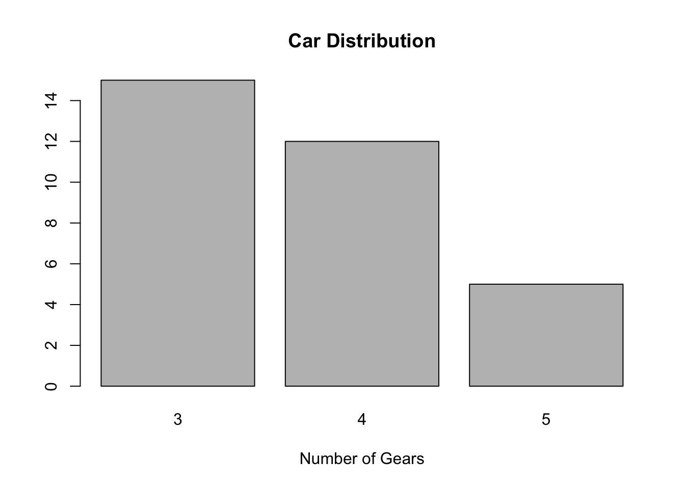

# Statistical Analysis
to discover relationships and features in given dataset

# Statistic types
* Descriptive
* Inference
* rational

# Statistical Anaysis
* Descriptive
* Diagnostic/Inference
* Predictive

## Panel Data
a dataset in which the behavior of entities are observed across time
## Cross sectional Data
a dataset collected by observing many subjects at the one point or period of time
## Time Series Data
a dataset collected at different points in time

# Line graph
for trend of variable over time 

```r
t=0:10 # time point
z= exp(-t/2) # a variable
w = 0.1*exp(t/3) # second variable
plot(t,z, type="l", col="green", lwd=5, xlab="time", ylab="concentration")
lines(t, w, col="red", lwd=2)
title("Exponential growth and decay")
legend(2,1,c("decay","growth"), lwd=c(5,2), col=c("green","red"), y.intersp=1.5)
```


# Bar graph
summarize a set of categorical data

```r
# Simple Bar Plot 
counts <- table(mtcars$gear)
barplot(counts, main="Car Distribution", 
   xlab="Number of Gears")
```



```r
# Simple Horizontal Bar Plot with Added Labels 
counts <- table(mtcars$gear)
barplot(counts, main="Car Distribution", horiz=TRUE,
  names.arg=c("3 Gears", "4 Gears", "5 Gears"))
```


```r
# Stacked Bar Plot with Colors and Legend
counts <- table(mtcars$vs, mtcars$gear)
barplot(counts, main="Car Distribution by Gears and VS",
  xlab="Number of Gears", col=c("darkblue","red"),
  legend = rownames(counts))
```


```r
# Grouped Bar Plot
counts <- table(mtcars$vs, mtcars$gear)
barplot(counts, main="Car Distribution by Gears and VS",
  xlab="Number of Gears", col=c("darkblue","red"),
  legend = rownames(counts), beside=TRUE)
```


# Histogram
summarize data measured on interval scale

```r
# Simple Histogram
hist(mtcars$mpg)
```


```r
# Add a Normal Curve (Thanks to Peter Dalgaard)
x <- mtcars$mpg 
h<-hist(x, breaks=10, col="red", xlab="Miles Per Gallon", 
   main="Histogram with Normal Curve") 
xfit<-seq(min(x),max(x),length=40) 
yfit<-dnorm(xfit,mean=mean(x),sd=sd(x)) 
yfit <- yfit*diff(h$mids[1:2])*length(x) 
lines(xfit, yfit, col="blue", lwd=2)
```


# Pei Chart
Proportional display from categorical data

```r
# Simple Pie Chart
slices <- c(10, 12,4, 16, 8)
lbls <- c("US", "UK", "Australia", "Germany", "France")
pie(slices, labels = lbls, main="Pie Chart of Countries")
```


```r
# 3D Exploded Pie Chart
library(plotrix)
slices <- c(10, 12, 4, 16, 8) 
lbls <- c("US", "UK", "Australia", "Germany", "France")
pie3D(slices,labels=lbls,explode=0.1,
   main="Pie Chart of Countries ")
```


# Scatter plots
relationship between two variables


