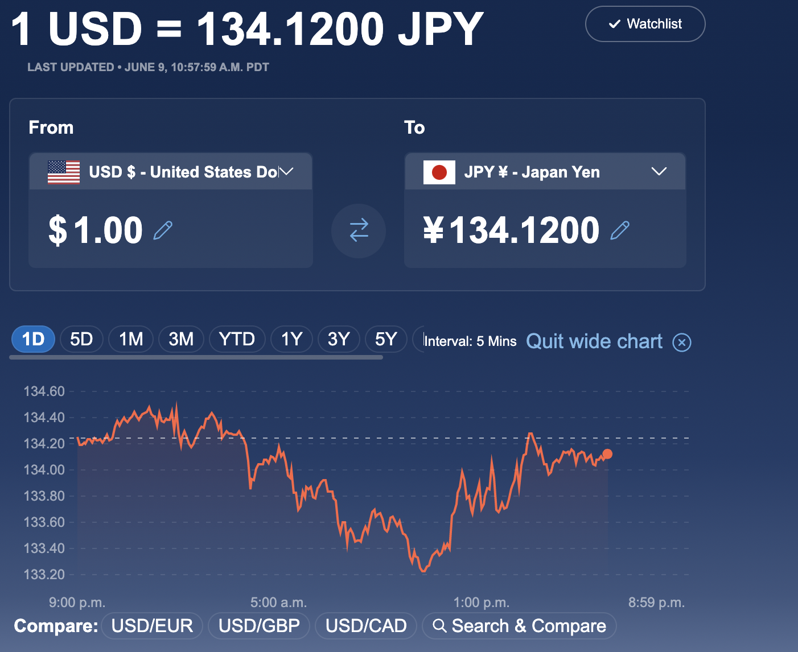
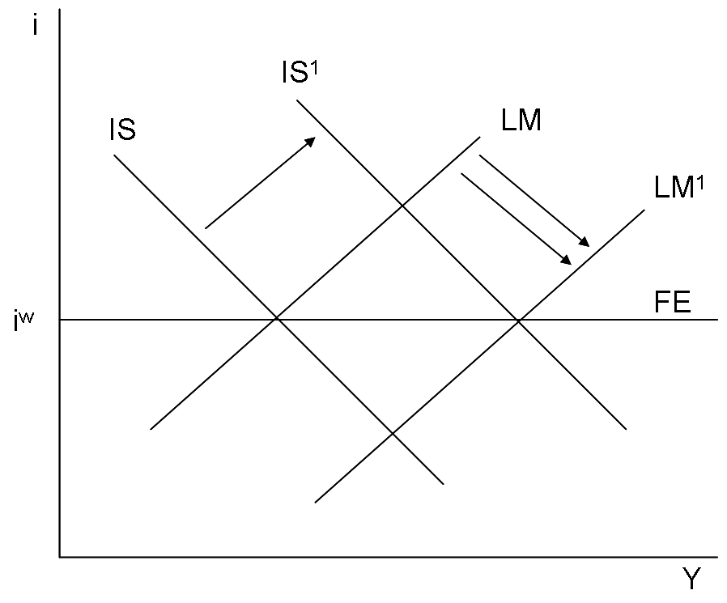

## The Mundell-Fleming Model is back!!

The Japanese yen is currently blasting off to a low of over ¥ 134 to USD 1. 
This is likely due to the Bank of Japan Governor Kuroda's statement that "households are becoming more tolerant of price hikes." 
His tone was that the yen should weaken further, 
and the market probably reacted to this.

### Differences in interest rates promote international capital flows
This effect can be explained by the classic Mundell-Fleming model. 
Consider the $IS-LM$ model in an open economy, 
where international capital flows are completely free and the real interest rate is fixed at $i_w$ throughout the world, and 
FE is the equilibrium real interest rate curve and $Y$ is income.

Under a flexible exchange rate system, 
even if the budget deficit is increased and the $IS$ curve is moved to the right to $IS^1$, the Japanese interest rate, determined by the intersection with the $LM$ curve, will be higher than $i^W$, causing capital inflows, a stronger yen, and lower exports.
This change will continue until the real interest rate returns to its equilibrium level $i^w$, so the $IS$ curve will return to its original level and fiscal policy will be ineffective.

On the other hand, if monetary policy increases the money supply to $LM^1$, the domestic interest rate $i'$, which is determined by the intersection with $IS$, becomes lower than the foreign interest rate $i^W$, resulting in capital outflows and a weaker yen.
This change continues until $i' = i^W$ and the $IS$ curve shifts to $IS^1$, which increases $Y$, so monetary policy is effective.

### Effective of Monetary Depreciation but Ineffective of Fiscal Deficits
However, as the difference in interest rates between Japan and the U.S. increases, this will increase foreign investment and shift the $IS$ curve to the right, thereby increasing GNP (including foreign investment). 
In other words, the budget deficit does not work, 
but inducing the yen to depreciate does.

In the past, a weak yen caused investment to increase due to export growth, 
but now there is a massive capital flight of yen borrowed at zero interest rates to invest in Asia. 
The BOJ's cheap money was invested in Asia.

If the dollar continues at this rate to around 140 yen to the dollar, Japanese global companies will improve their performance and GNP will grow significantly. 
However, GDP in Japan will not grow. 
Manufacturing employment will not increase and wages will not rise because of increased outsourcing overseas.

This is the globalization of the world economy that has been underway since the 1990's the end of the Cold War and continued because the opening of communism led to the flow of cheap (and competent) labour.
While we need to be careful about resource inflation and economic security, 
we should not be afraid of the weak yen. 
If the yen continues to depreciate to the 140 yen level over the long term, we can expect companies that have gone overseas to return to Japan. 
This seems to be the goal of Governor Kuroda. 
Tourists and inward direct investment will also increase.

However, the gap between large global corporations and small and medium-sized domestic firms will widen. 
This is because the weak yen will lead to import inflation and lower real wages. 

To remedy this, in my opinion, the current complicated and ad hoc social security system should be replaced by a lump-sum redistribution system such as a basic income, a negative income tax, or minimum guaranteed pension.

